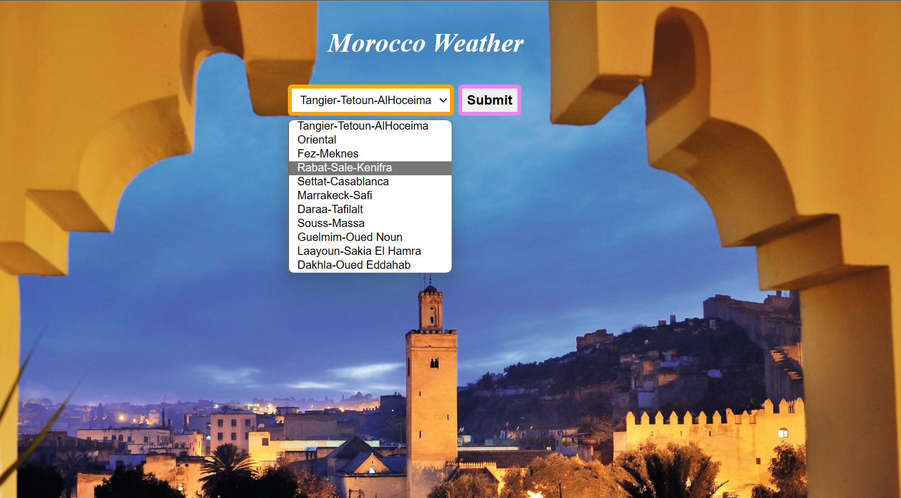
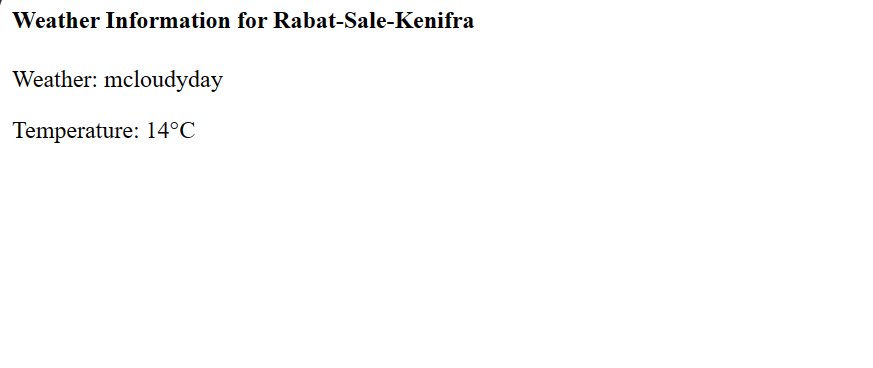

**Weather Application Description**

@Author:Ouasli Oumaima
Welcome to our Moroccan weather application! 
Our app provides  a simple service for the user to kknow the latest data weather information to different regions of Morocco.
It checks the temperature anf the  weather state  of every region in Morocco.
you with accurate and up-to-date weather information to help you plan your day effectively.
Whether you're checking the forecast for your current Moroccan region or any other Moroccon region.

**Key Features:**

1. **Real-Time Weather Updates:** Get the latest weather updates in real-time For your region.

2. **Detailed Forecast:** Our app provides detailed forecasts, including temperature weather state. 

3. **Multiple Locations:** Easily switch between multiple regions to stay informed about the weather in your area as well as other places you care about.

### Result Example:
